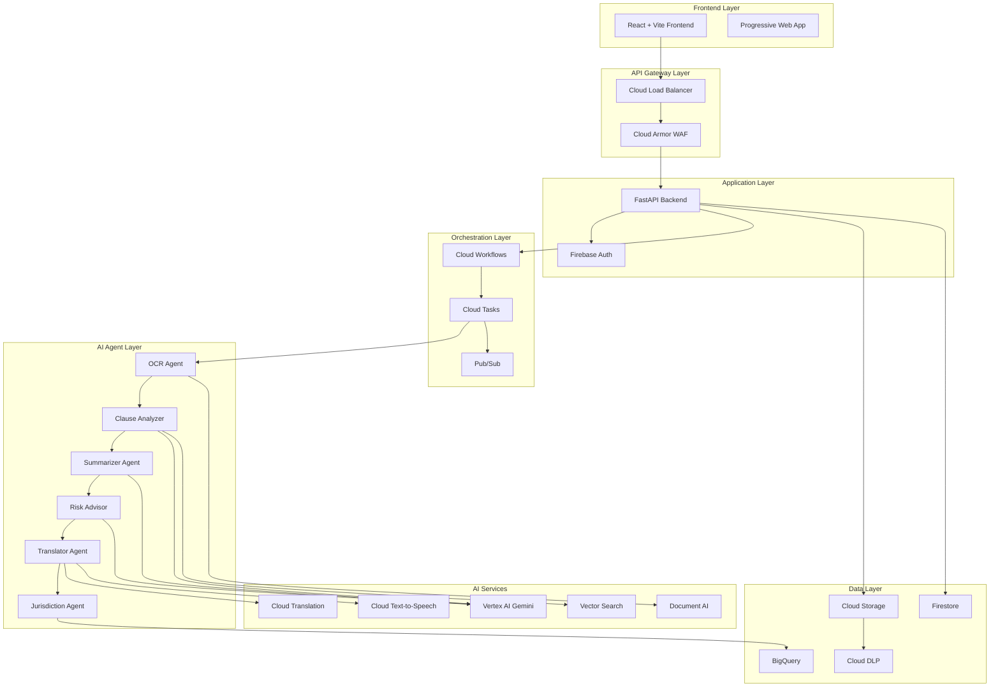

# Design Document

## Overview

The Generative AI Legal Companion is architected as a cloud-native, multi-agent system built on Google Cloud Platform. The system follows a microservices architecture with a React frontend, FastAPI backend, and CrewAI-orchestrated agent pipeline. The design emphasizes privacy-by-design, scalability, and accessibility while providing sophisticated AI-powered legal document analysis.

## Architecture

### High-Level Architecture



### Component Architecture

The system is divided into several key architectural layers:

1. **Presentation Layer**: React-based frontend with real-time updates
2. **API Layer**: FastAPI backend with authentication and rate limiting
3. **Orchestration Layer**: Cloud Workflows coordinating multi-agent pipeline
4. **Agent Layer**: Specialized CrewAI agents for different processing tasks
5. **AI Services Layer**: Google Cloud AI services for core functionality
6. **Data Layer**: Secure storage and database services

## Components and Interfaces

### Frontend Components

#### Core UI Components
- **DocumentUploader**: Handles multi-format file uploads with drag-and-drop
- **PDFViewer**: Renders PDFs with annotation overlay using react-pdf
- **ClauseHeatmap**: Visual risk overlay with color-coded clause highlighting
- **ProgressTimeline**: Real-time processing status with SSE integration
- **VoiceInterface**: Voice recording/playback with WebAudio API
- **ExportCenter**: Multi-format export with download management
- **AccessibilityControls**: Font scaling, contrast, and screen reader support

#### State Management
```typescript
// Zustand store structure
interface AppState {
  documents: DocumentState[];
  currentJob: JobState | null;
  user: UserState | null;
  ui: UIState;
  accessibility: AccessibilityState;
}

interface DocumentState {
  id: string;
  filename: string;
  status: ProcessingStatus;
  clauses: ClauseAnalysis[];
  summary: DocumentSummary;
  exports: ExportUrls;
}
```

#### API Integration
- **TanStack Query** for server state management and caching
- **Axios** with interceptors for authentication and error handling
- **SSE Client** for real-time job progress updates
- **Firebase SDK** for authentication and Firestore real-time updates

### Backend Components

#### FastAPI Application Structure
```python
# Main application structure
app/
├── api/
│   ├── v1/
│   │   ├── upload.py      # Document upload endpoints
│   │   ├── jobs.py        # Job management and status
│   │   ├── qa.py          # Voice Q&A endpoints
│   │   └── exports.py     # Export generation
├── agents/
│   ├── ocr_agent.py       # Document AI integration
│   ├── analyzer_agent.py  # Clause classification
│   ├── summarizer_agent.py # Plain language summaries
│   ├── risk_agent.py      # Risk assessment
│   └── translator_agent.py # Multi-language support
├── core/
│   ├── config.py          # Configuration management
│   ├── security.py        # Authentication & authorization
│   └── dependencies.py    # FastAPI dependencies
├── models/
│   ├── document.py        # Document data models
│   ├── job.py            # Job processing models
│   └── analysis.py       # Analysis result models
└── services/
    ├── storage.py         # Cloud Storage operations
    ├── firestore.py       # Database operations
    └── workflow.py        # Cloud Workflows integration
```

#### Key API Endpoints
```python
# Core API endpoints
POST /v1/upload                    # Document upload with signed URLs
GET  /v1/jobs/{job_id}/status      # Job status and progress
GET  /v1/jobs/{job_id}/stream      # SSE progress updates
POST /v1/jobs/{job_id}/analyze     # Trigger analysis pipeline
GET  /v1/jobs/{job_id}/results     # Analysis results and exports
POST /v1/qa                        # Voice Q&A interactions
GET  /v1/exports/{export_id}       # Download generated exports
```

### Multi-Agent System Design

#### CrewAI Agent Configuration
```python
# Agent definitions with specific roles and tools
class LegalCompanionCrew:
    def __init__(self):
        self.ocr_agent = Agent(
            role="Document OCR Specialist",
            goal="Extract and structure text from legal documents",
            tools=[DocumentAITool(), VisionAPITool()],
            backstory="Expert in document digitization and layout analysis"
        )
        
        self.clause_analyzer = Agent(
            role="Legal Clause Analyzer",
            goal="Classify and score legal clauses for risk assessment",
            tools=[GeminiTool(), VectorSearchTool()],
            backstory="Specialized in contract analysis and risk identification"
        )
        
        # Additional agents...
```

#### Agent Workflow Pipeline
```python
# Sequential agent execution with error handling
@task
def analyze_document_pipeline(document_id: str):
    # 1. OCR Processing
    structured_text = ocr_agent.execute(document_id)
    
    # 2. Clause Analysis
    clause_analysis = analyzer_agent.execute(structured_text)
    
    # 3. Summarization
    summary = summarizer_agent.execute(structured_text, clause_analysis)
    
    # 4. Risk Assessment
    risk_advice = risk_agent.execute(clause_analysis, jurisdiction_context)
    
    # 5. Translation & Audio
    multilingual_output = translator_agent.execute(summary, risk_advice)
    
    return ProcessingResult(
        clauses=clause_analysis,
        summary=summary,
        risks=risk_advice,
        translations=multilingual_output
    )
```

### AI Services Integration

#### Vertex AI Gemini Integration
```python
# Gemini model configuration for different tasks
class GeminiService:
    def __init__(self):
        self.flash_model = GenerativeModel("gemini-1.5-flash")  # Classification
        self.pro_model = GenerativeModel("gemini-1.5-pro")     # Complex analysis
        
    async def classify_clauses(self, text: str, role: str) -> ClauseAnalysis:
        prompt = self._build_classification_prompt(text, role)
        response = await self.flash_model.generate_content_async(prompt)
        return self._parse_classification_response(response)
        
    async def generate_risk_advice(self, clauses: List[Clause]) -> RiskAdvice:
        prompt = self._build_risk_prompt(clauses)
        response = await self.pro_model.generate_content_async(prompt)
        return self._parse_risk_response(response)
```

#### Vector Search Implementation
```python
# Vector embeddings for semantic search
class VectorSearchService:
    def __init__(self):
        self.index = aiplatform.MatchingEngineIndex(INDEX_ID)
        self.endpoint = aiplatform.MatchingEngineIndexEndpoint(ENDPOINT_ID)
        
    async def embed_clauses(self, clauses: List[str]) -> List[Embedding]:
        embeddings = []
        for clause in clauses:
            embedding = await self._generate_embedding(clause)
            embeddings.append(embedding)
        return embeddings
        
    async def search_similar_clauses(self, query: str, top_k: int = 5) -> List[Clause]:
        query_embedding = await self._generate_embedding(query)
        results = self.endpoint.find_neighbors(
            deployed_index_id=DEPLOYED_INDEX_ID,
            queries=[query_embedding],
            num_neighbors=top_k
        )
        return self._format_search_results(results)
```

## Data Models

### Core Data Structures

#### Document Model
```python
class Document(BaseModel):
    id: str = Field(..., description="Unique document identifier")
    filename: str = Field(..., description="Original filename")
    content_type: str = Field(..., description="MIME type")
    size_bytes: int = Field(..., description="File size")
    upload_timestamp: datetime = Field(default_factory=datetime.utcnow)
    processing_status: ProcessingStatus = Field(default=ProcessingStatus.QUEUED)
    user_id: str = Field(..., description="Owner user ID")
    jurisdiction: Optional[str] = Field(None, description="Legal jurisdiction")
    user_role: Optional[str] = Field(None, description="User role (tenant, borrower, etc.)")
    
class ProcessedDocument(Document):
    structured_text: str = Field(..., description="OCR extracted text")
    clauses: List[Clause] = Field(default_factory=list)
    summary: Optional[DocumentSummary] = None
    risk_assessment: Optional[RiskAssessment] = None
    translations: Dict[str, Any] = Field(default_factory=dict)
    audio_narration: Optional[AudioNarration] = None
```

#### Clause Analysis Model
```python
class Clause(BaseModel):
    id: str = Field(..., description="Unique clause identifier")
    text: str = Field(..., description="Original clause text")
    clause_number: Optional[str] = Field(None, description="Document clause number")
    classification: ClauseClassification = Field(..., description="Risk classification")
    risk_score: float = Field(..., ge=0, le=1, description="Risk score 0-1")
    impact_score: int = Field(..., ge=0, le=100, description="Impact score 0-100")
    likelihood_score: int = Field(..., ge=0, le=100, description="Likelihood score 0-100")
    role_specific_analysis: Dict[str, RoleAnalysis] = Field(default_factory=dict)
    safer_alternatives: List[SaferAlternative] = Field(default_factory=list)
    legal_citations: List[LegalCitation] = Field(default_factory=list)
    
class ClauseClassification(str, Enum):
    BENEFICIAL = "beneficial"
    CAUTION = "caution"
    RISKY = "risky"
    
class SaferAlternative(BaseModel):
    suggested_text: str = Field(..., description="Safer clause wording")
    rationale: str = Field(..., description="Why this is safer")
    legal_basis: Optional[str] = Field(None, description="Legal justification")
```

#### Job Processing Model
```python
class Job(BaseModel):
    id: str = Field(..., description="Unique job identifier")
    document_id: str = Field(..., description="Associated document ID")
    user_id: str = Field(..., description="Job owner")
    status: JobStatus = Field(default=JobStatus.QUEUED)
    current_stage: ProcessingStage = Field(default=ProcessingStage.UPLOAD)
    progress_percentage: int = Field(default=0, ge=0, le=100)
    created_at: datetime = Field(default_factory=datetime.utcnow)
    started_at: Optional[datetime] = None
    completed_at: Optional[datetime] = None
    error_message: Optional[str] = None
    results: Optional[JobResults] = None
    
class JobStatus(str, Enum):
    QUEUED = "queued"
    PROCESSING = "processing"
    COMPLETED = "completed"
    FAILED = "failed"
    
class ProcessingStage(str, Enum):
    UPLOAD = "upload"
    OCR = "ocr"
    ANALYSIS = "analysis"
    SUMMARIZATION = "summarization"
    RISK_ASSESSMENT = "risk_assessment"
    TRANSLATION = "translation"
    AUDIO_GENERATION = "audio_generation"
    EXPORT_GENERATION = "export_generation"
```

### Database Schema

#### Firestore Collections
```javascript
// Firestore collection structure
collections: {
  users: {
    [userId]: {
      email: string,
      displayName: string,
      preferences: {
        language: string,
        jurisdiction: string,
        defaultRole: string,
        accessibility: AccessibilitySettings
      },
      createdAt: timestamp,
      lastLoginAt: timestamp
    }
  },
  
  documents: {
    [documentId]: {
      filename: string,
      contentType: string,
      sizeBytes: number,
      userId: string,
      uploadedAt: timestamp,
      processingStatus: string,
      storageUrl: string,
      jurisdiction: string,
      userRole: string
    }
  },
  
  jobs: {
    [jobId]: {
      documentId: string,
      userId: string,
      status: string,
      currentStage: string,
      progressPercentage: number,
      createdAt: timestamp,
      startedAt: timestamp,
      completedAt: timestamp,
      errorMessage: string,
      results: JobResults
    }
  },
  
  clauses: {
    [clauseId]: {
      documentId: string,
      text: string,
      clauseNumber: string,
      classification: string,
      riskScore: number,
      impactScore: number,
      likelihoodScore: number,
      roleAnalysis: object,
      saferAlternatives: array,
      legalCitations: array
    }
  }
}
```

## Error Handling

### Error Classification and Recovery

#### Client-Side Error Handling
```typescript
// Error boundary and recovery strategies
class ErrorBoundary extends React.Component {
  handleError(error: Error, errorInfo: ErrorInfo) {
    // Log to monitoring service
    logger.error('Frontend error', { error, errorInfo });
    
    // Show user-friendly error message
    this.setState({ hasError: true, errorType: this.classifyError(error) });
  }
  
  classifyError(error: Error): ErrorType {
    if (error.message.includes('network')) return ErrorType.NETWORK;
    if (error.message.includes('auth')) return ErrorType.AUTHENTICATION;
    if (error.message.includes('quota')) return ErrorType.QUOTA_EXCEEDED;
    return ErrorType.UNKNOWN;
  }
}

// Retry logic for API calls
const apiClient = axios.create({
  timeout: 30000,
  retries: 3,
  retryDelay: (retryCount) => Math.pow(2, retryCount) * 1000
});
```

#### Backend Error Handling
```python
# Comprehensive error handling middleware
@app.exception_handler(Exception)
async def global_exception_handler(request: Request, exc: Exception):
    error_id = str(uuid.uuid4())
    
    # Log error with context
    logger.error(
        f"Unhandled exception {error_id}",
        extra={
            "error_id": error_id,
            "path": request.url.path,
            "method": request.method,
            "user_id": getattr(request.state, "user_id", None),
            "exception": str(exc),
            "traceback": traceback.format_exc()
        }
    )
    
    # Return user-friendly error
    return JSONResponse(
        status_code=500,
        content={
            "error": "Internal server error",
            "error_id": error_id,
            "message": "An unexpected error occurred. Please try again."
        }
    )

# Agent-specific error handling
class AgentExecutionError(Exception):
    def __init__(self, agent_name: str, stage: str, original_error: Exception):
        self.agent_name = agent_name
        self.stage = stage
        self.original_error = original_error
        super().__init__(f"Agent {agent_name} failed at stage {stage}: {original_error}")

# Retry logic for agent failures
async def execute_agent_with_retry(agent: Agent, task: Task, max_retries: int = 3):
    for attempt in range(max_retries):
        try:
            return await agent.execute(task)
        except Exception as e:
            if attempt == max_retries - 1:
                raise AgentExecutionError(agent.name, task.stage, e)
            
            # Exponential backoff
            await asyncio.sleep(2 ** attempt)
```

### Workflow Error Recovery
```yaml
# Cloud Workflows error handling
main:
  steps:
    - ocr_step:
        try:
          call: ocr_agent
          args:
            document_id: ${document_id}
        retry:
          predicate: ${http.default_retry_predicate}
          max_retries: 3
          backoff:
            initial_delay: 2
            max_delay: 60
            multiplier: 2
        except:
          as: e
          steps:
            - log_error:
                call: sys.log
                args:
                  text: ${"OCR failed: " + e.message}
                  severity: ERROR
            - update_job_status:
                call: http.post
                args:
                  url: ${api_base_url + "/jobs/" + document_id + "/status"}
                  body:
                    status: "failed"
                    error: ${e.message}
```

## Testing Strategy

### Frontend Testing
```typescript
// Component testing with React Testing Library
describe('DocumentUploader', () => {
  test('handles file upload with progress tracking', async () => {
    const mockUpload = jest.fn().mockResolvedValue({ jobId: 'test-job' });
    render(<DocumentUploader onUpload={mockUpload} />);
    
    const file = new File(['test content'], 'test.pdf', { type: 'application/pdf' });
    const input = screen.getByLabelText(/upload document/i);
    
    await user.upload(input, file);
    
    expect(mockUpload).toHaveBeenCalledWith(file);
    expect(screen.getByText(/uploading/i)).toBeInTheDocument();
  });
  
  test('shows error for unsupported file types', async () => {
    render(<DocumentUploader />);
    
    const file = new File(['test'], 'test.exe', { type: 'application/exe' });
    const input = screen.getByLabelText(/upload document/i);
    
    await user.upload(input, file);
    
    expect(screen.getByText(/unsupported file type/i)).toBeInTheDocument();
  });
});

// Integration testing with MSW
const server = setupServer(
  rest.post('/v1/upload', (req, res, ctx) => {
    return res(ctx.json({ jobId: 'test-job', uploadUrl: 'signed-url' }));
  }),
  rest.get('/v1/jobs/:jobId/stream', (req, res, ctx) => {
    return res(
      ctx.set('Content-Type', 'text/event-stream'),
      ctx.body('data: {"status": "processing", "stage": "ocr"}\n\n')
    );
  })
);
```

### Backend Testing
```python
# FastAPI testing with pytest
@pytest.fixture
async def client():
    async with AsyncClient(app=app, base_url="http://test") as ac:
        yield ac

@pytest.fixture
def mock_firebase_auth():
    with patch('app.core.security.verify_firebase_token') as mock:
        mock.return_value = {"uid": "test-user", "email": "test@example.com"}
        yield mock

async def test_upload_document(client: AsyncClient, mock_firebase_auth):
    # Test document upload endpoint
    files = {"file": ("test.pdf", b"fake pdf content", "application/pdf")}
    headers = {"Authorization": "Bearer fake-token"}
    
    response = await client.post("/v1/upload", files=files, headers=headers)
    
    assert response.status_code == 200
    data = response.json()
    assert "jobId" in data
    assert "uploadUrl" in data

# Agent testing with mocked AI services
@pytest.fixture
def mock_gemini():
    with patch('app.agents.analyzer_agent.GenerativeModel') as mock:
        mock_instance = mock.return_value
        mock_instance.generate_content_async.return_value = Mock(
            text='{"classification": "risky", "score": 0.8}'
        )
        yield mock_instance

async def test_clause_analyzer_agent(mock_gemini):
    agent = ClauseAnalyzerAgent()
    clauses = ["This clause allows unilateral changes without notice."]
    
    result = await agent.analyze_clauses(clauses, role="tenant")
    
    assert len(result) == 1
    assert result[0].classification == ClauseClassification.RISKY
    assert result[0].risk_score == 0.8
```

### End-to-End Testing
```python
# E2E testing with Playwright
async def test_complete_document_analysis_flow(page: Page):
    # Navigate to application
    await page.goto("http://localhost:3000")
    
    # Upload document
    await page.set_input_files('input[type="file"]', 'test-documents/rental-agreement.pdf')
    
    # Wait for processing to complete
    await page.wait_for_selector('[data-testid="analysis-complete"]', timeout=60000)
    
    # Verify clause heatmap is displayed
    heatmap = page.locator('[data-testid="clause-heatmap"]')
    await expect(heatmap).to_be_visible()
    
    # Test voice Q&A
    await page.click('[data-testid="voice-qa-button"]')
    await page.wait_for_selector('[data-testid="recording-indicator"]')
    
    # Simulate voice input (in real test, would use audio file)
    await page.evaluate('window.mockVoiceInput("What are the risky clauses?")')
    
    # Verify response
    await page.wait_for_selector('[data-testid="qa-response"]')
    response = await page.text_content('[data-testid="qa-response"]')
    assert "risky" in response.lower()
    
    # Test export functionality
    await page.click('[data-testid="export-pdf-button"]')
    download = await page.wait_for_download()
    assert download.suggested_filename.endswith('.pdf')
```

### Performance Testing
```python
# Load testing with Locust
class LegalCompanionUser(HttpUser):
    wait_time = between(1, 3)
    
    def on_start(self):
        # Authenticate user
        self.client.post("/auth/login", json={
            "email": "test@example.com",
            "password": "testpass"
        })
    
    @task(3)
    def upload_document(self):
        files = {"file": ("test.pdf", b"fake content", "application/pdf")}
        response = self.client.post("/v1/upload", files=files)
        
        if response.status_code == 200:
            job_id = response.json()["jobId"]
            self.monitor_job_progress(job_id)
    
    @task(1)
    def voice_qa(self):
        self.client.post("/v1/qa", json={
            "jobId": "test-job",
            "query": "What are the main risks?",
            "role": "tenant"
        })
    
    def monitor_job_progress(self, job_id: str):
        # Monitor job until completion
        for _ in range(30):  # Max 30 checks
            response = self.client.get(f"/v1/jobs/{job_id}/status")
            if response.json().get("status") == "completed":
                break
            time.sleep(2)
```

This comprehensive design document provides the technical foundation for implementing the AI Legal Companion system. The architecture emphasizes scalability, security, and user experience while maintaining the sophisticated AI capabilities required for legal document analysis.

<function_calls>
<invoke name="userInput">
<parameter name="question">**Does the design look good? If so, we can move on to the implementation plan.**