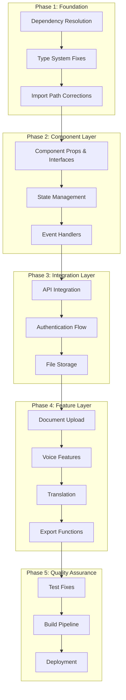

# Design Document

## Overview

The bug fixing and integration design addresses systematic resolution of TypeScript compilation errors, missing dependencies, type mismatches, and integration issues in the Legal Companion project. The approach follows a layered debugging strategy, starting with foundational issues (dependencies, types) and progressing to higher-level integration problems (API connectivity, feature functionality). This ensures a stable foundation before addressing complex feature interactions.

## Architecture

### Bug Resolution Strategy



### Error Classification System

The debugging approach categorizes errors into five main types:

1. **Dependency Errors**: Missing packages, version conflicts, import resolution
2. **Type Errors**: TypeScript compilation issues, interface mismatches, implicit any
3. **Integration Errors**: API connectivity, authentication, service configuration
4. **Feature Errors**: Component functionality, user interaction, data flow
5. **Build Errors**: Compilation, bundling, deployment pipeline issues

## Components and Interfaces

### Error Detection and Analysis

#### TypeScript Error Parser
```typescript
interface TypeScriptError {
  file: string;
  line: number;
  column: number;
  code: string;
  message: string;
  category: ErrorCategory;
  severity: 'error' | 'warning';
  fixStrategy: FixStrategy;
}

enum ErrorCategory {
  MISSING_DEPENDENCY = 'missing_dependency',
  TYPE_MISMATCH = 'type_mismatch',
  UNUSED_VARIABLE = 'unused_variable',
  MISSING_PROPERTY = 'missing_property',
  IMPORT_ERROR = 'import_error',
  INTERFACE_ERROR = 'interface_error'
}

interface FixStrategy {
  type: 'install_dependency' | 'fix_type' | 'remove_unused' | 'add_property' | 'fix_import';
  action: string;
  priority: number;
  dependencies?: string[];
}
```

#### Dependency Analysis System
```typescript
interface DependencyAnalysis {
  missing: MissingDependency[];
  outdated: OutdatedDependency[];
  conflicts: DependencyConflict[];
  unused: UnusedDependency[];
}

interface MissingDependency {
  name: string;
  requiredBy: string[];
  suggestedVersion: string;
  installCommand: string;
  category: 'dependencies' | 'devDependencies' | 'peerDependencies';
}

interface DependencyConflict {
  package: string;
  requiredVersions: string[];
  conflictingPackages: string[];
  resolution: string;
}
```

### Component Interface Standardization

#### Standardized Component Props
```typescript
// Base component props with accessibility and error handling
interface BaseComponentProps {
  className?: string;
  'data-testid'?: string;
  'aria-label'?: string;
  'aria-describedby'?: string;
  onError?: (error: Error) => void;
}

// Form component props with validation
interface FormComponentProps extends BaseComponentProps {
  value?: any;
  onChange?: (value: any) => void;
  onBlur?: () => void;
  error?: string;
  disabled?: boolean;
  required?: boolean;
  validation?: ValidationRule[];
}

// API component props with loading states
interface APIComponentProps extends BaseComponentProps {
  loading?: boolean;
  error?: string | null;
  retry?: () => void;
  onSuccess?: (data: any) => void;
  onError?: (error: Error) => void;
}
```

#### Type-Safe API Integration
```typescript
// Standardized API response wrapper
interface APIResponse<T> {
  data: T;
  status: number;
  message?: string;
  errors?: APIError[];
  metadata?: {
    timestamp: string;
    requestId: string;
    version: string;
  };
}

interface APIError {
  code: string;
  message: string;
  field?: string;
  details?: Record<string, any>;
}

// Type-safe API client
class TypeSafeAPIClient {
  async get<T>(endpoint: string): Promise<APIResponse<T>> {
    // Implementation with proper error handling and type checking
  }
  
  async post<T, U>(endpoint: string, data: U): Promise<APIResponse<T>> {
    // Implementation with request/response validation
  }
}
```

### State Management Standardization

#### Zustand Store Type Safety
```typescript
// Standardized store interface
interface AppStore {
  // User state
  user: User | null;
  setUser: (user: User | null) => void;
  
  // Document state
  documents: Document[];
  addDocument: (document: Document) => void;
  updateDocument: (id: string, updates: Partial<Document>) => void;
  removeDocument: (id: string) => void;
  
  // Job state
  jobs: Job[];
  addJob: (job: Job) => void;
  updateJob: (id: string, updates: Partial<Job>) => void;
  
  // UI state
  ui: UIState;
  setUIState: (updates: Partial<UIState>) => void;
  
  // Error state
  errors: AppError[];
  addError: (error: AppError) => void;
  clearError: (id: string) => void;
  clearAllErrors: () => void;
}

interface UIState {
  theme: 'light' | 'dark' | 'high-contrast';
  fontSize: number;
  reducedMotion: boolean;
  sidebarOpen: boolean;
  loading: boolean;
}
```

## Data Models

### Standardized Error Handling

#### Frontend Error Model
```typescript
interface AppError {
  id: string;
  type: ErrorType;
  message: string;
  details?: Record<string, any>;
  timestamp: Date;
  source: string;
  severity: 'low' | 'medium' | 'high' | 'critical';
  userMessage?: string;
  recoveryActions?: RecoveryAction[];
}

enum ErrorType {
  NETWORK_ERROR = 'network_error',
  AUTHENTICATION_ERROR = 'authentication_error',
  VALIDATION_ERROR = 'validation_error',
  PERMISSION_ERROR = 'permission_error',
  SERVICE_ERROR = 'service_error',
  UNKNOWN_ERROR = 'unknown_error'
}

interface RecoveryAction {
  label: string;
  action: () => void;
  primary?: boolean;
}
```

#### Backend Error Model
```python
from enum import Enum
from typing import Optional, Dict, Any, List
from pydantic import BaseModel

class ErrorCode(str, Enum):
    VALIDATION_ERROR = "validation_error"
    AUTHENTICATION_ERROR = "authentication_error"
    AUTHORIZATION_ERROR = "authorization_error"
    NOT_FOUND_ERROR = "not_found_error"
    CONFLICT_ERROR = "conflict_error"
    RATE_LIMIT_ERROR = "rate_limit_error"
    SERVICE_ERROR = "service_error"
    INTERNAL_ERROR = "internal_error"

class APIError(BaseModel):
    code: ErrorCode
    message: str
    details: Optional[Dict[str, Any]] = None
    field: Optional[str] = None
    request_id: Optional[str] = None

class ErrorResponse(BaseModel):
    error: APIError
    timestamp: str
    path: str
    method: str
```

### Type-Safe Data Transfer Objects

#### Document Processing DTOs
```typescript
// Frontend document types
interface DocumentUploadRequest {
  file: File;
  userRole?: UserRole;
  jurisdiction?: string;
  processingOptions?: ProcessingOptions;
}

interface DocumentUploadResponse {
  jobId: string;
  uploadUrl: string;
  expiresAt: string;
}

interface ProcessingOptions {
  enableOCR: boolean;
  enableTranslation: boolean;
  targetLanguages?: string[];
  enableVoiceGeneration: boolean;
  confidenceThreshold?: number;
}
```

```python
# Backend document models
from pydantic import BaseModel, Field
from typing import Optional, List
from enum import Enum

class UserRole(str, Enum):
    TENANT = "tenant"
    LANDLORD = "landlord"
    BORROWER = "borrower"
    LENDER = "lender"
    BUYER = "buyer"
    SELLER = "seller"

class DocumentUploadRequest(BaseModel):
    filename: str = Field(..., description="Original filename")
    content_type: str = Field(..., description="MIME type")
    size_bytes: int = Field(..., gt=0, description="File size in bytes")
    user_role: Optional[UserRole] = None
    jurisdiction: Optional[str] = None
    processing_options: Optional[ProcessingOptions] = None

class ProcessingOptions(BaseModel):
    enable_ocr: bool = True
    enable_translation: bool = False
    target_languages: List[str] = Field(default_factory=list)
    enable_voice_generation: bool = False
    confidence_threshold: float = Field(default=0.7, ge=0.0, le=1.0)
```

## Error Handling

### Comprehensive Error Recovery System

#### Frontend Error Boundary
```typescript
interface ErrorBoundaryState {
  hasError: boolean;
  error: Error | null;
  errorInfo: ErrorInfo | null;
  errorId: string;
}

class GlobalErrorBoundary extends React.Component<
  React.PropsWithChildren<{}>,
  ErrorBoundaryState
> {
  constructor(props: React.PropsWithChildren<{}>) {
    super(props);
    this.state = {
      hasError: false,
      error: null,
      errorInfo: null,
      errorId: ''
    };
  }

  static getDerivedStateFromError(error: Error): Partial<ErrorBoundaryState> {
    return {
      hasError: true,
      error,
      errorId: generateErrorId()
    };
  }

  componentDidCatch(error: Error, errorInfo: ErrorInfo) {
    // Log error to monitoring service
    this.logError(error, errorInfo);
    
    // Update state with error info
    this.setState({ errorInfo });
    
    // Show user-friendly error message
    this.showErrorNotification(error);
  }

  private logError(error: Error, errorInfo: ErrorInfo) {
    const errorData = {
      message: error.message,
      stack: error.stack,
      componentStack: errorInfo.componentStack,
      errorId: this.state.errorId,
      timestamp: new Date().toISOString(),
      userAgent: navigator.userAgent,
      url: window.location.href
    };
    
    // Send to monitoring service
    monitoringService.logError(errorData);
  }

  render() {
    if (this.state.hasError) {
      return (
        <ErrorFallback
          error={this.state.error}
          errorId={this.state.errorId}
          onRetry={() => this.setState({ hasError: false, error: null })}
          onReport={() => this.reportError()}
        />
      );
    }

    return this.props.children;
  }
}
```

#### Backend Error Handling Middleware
```python
import traceback
import uuid
from fastapi import Request, HTTPException
from fastapi.responses import JSONResponse
from fastapi.exceptions import RequestValidationError
import structlog

logger = structlog.get_logger()

async def error_handling_middleware(request: Request, call_next):
    """Global error handling middleware."""
    try:
        response = await call_next(request)
        return response
    except HTTPException as e:
        # Handle known HTTP exceptions
        return await handle_http_exception(request, e)
    except RequestValidationError as e:
        # Handle validation errors
        return await handle_validation_error(request, e)
    except Exception as e:
        # Handle unexpected errors
        return await handle_unexpected_error(request, e)

async def handle_http_exception(request: Request, exc: HTTPException):
    """Handle HTTP exceptions with proper logging."""
    error_id = str(uuid.uuid4())
    
    logger.warning(
        "HTTP exception occurred",
        error_id=error_id,
        status_code=exc.status_code,
        detail=exc.detail,
        path=request.url.path,
        method=request.method
    )
    
    return JSONResponse(
        status_code=exc.status_code,
        content={
            "error": {
                "code": f"http_{exc.status_code}",
                "message": exc.detail,
                "request_id": error_id
            },
            "timestamp": datetime.utcnow().isoformat(),
            "path": request.url.path,
            "method": request.method
        }
    )

async def handle_validation_error(request: Request, exc: RequestValidationError):
    """Handle request validation errors."""
    error_id = str(uuid.uuid4())
    
    logger.error(
        "Validation error occurred",
        error_id=error_id,
        errors=exc.errors(),
        path=request.url.path,
        method=request.method
    )
    
    return JSONResponse(
        status_code=422,
        content={
            "error": {
                "code": "validation_error",
                "message": "Request validation failed",
                "details": exc.errors(),
                "request_id": error_id
            },
            "timestamp": datetime.utcnow().isoformat(),
            "path": request.url.path,
            "method": request.method
        }
    )
```

### Service Integration Error Handling

#### Firebase Service Error Handling
```typescript
class FirebaseErrorHandler {
  static handleAuthError(error: any): AppError {
    const errorMap: Record<string, string> = {
      'auth/user-not-found': 'No account found with this email address.',
      'auth/wrong-password': 'Incorrect password. Please try again.',
      'auth/too-many-requests': 'Too many failed attempts. Please try again later.',
      'auth/network-request-failed': 'Network error. Please check your connection.',
      'auth/invalid-email': 'Please enter a valid email address.',
      'auth/weak-password': 'Password should be at least 6 characters long.'
    };

    const userMessage = errorMap[error.code] || 'An authentication error occurred.';
    
    return {
      id: generateErrorId(),
      type: ErrorType.AUTHENTICATION_ERROR,
      message: error.message,
      userMessage,
      timestamp: new Date(),
      source: 'firebase-auth',
      severity: 'medium',
      details: { code: error.code },
      recoveryActions: [
        {
          label: 'Try Again',
          action: () => window.location.reload(),
          primary: true
        },
        {
          label: 'Reset Password',
          action: () => navigateToPasswordReset()
        }
      ]
    };
  }

  static handleStorageError(error: any): AppError {
    const errorMap: Record<string, string> = {
      'storage/unauthorized': 'You do not have permission to access this file.',
      'storage/canceled': 'File upload was canceled.',
      'storage/unknown': 'An unknown error occurred during file upload.',
      'storage/object-not-found': 'File not found.',
      'storage/quota-exceeded': 'Storage quota exceeded.'
    };

    const userMessage = errorMap[error.code] || 'A storage error occurred.';
    
    return {
      id: generateErrorId(),
      type: ErrorType.SERVICE_ERROR,
      message: error.message,
      userMessage,
      timestamp: new Date(),
      source: 'firebase-storage',
      severity: 'high',
      details: { code: error.code },
      recoveryActions: [
        {
          label: 'Retry Upload',
          action: () => retryUpload(),
          primary: true
        }
      ]
    };
  }
}
```

## Testing Strategy

### Automated Error Detection and Testing

#### TypeScript Error Testing
```typescript
// Test suite for TypeScript compilation
describe('TypeScript Compilation', () => {
  test('should compile without errors', async () => {
    const result = await runTypeScriptCompiler();
    expect(result.errors).toHaveLength(0);
    expect(result.exitCode).toBe(0);
  });

  test('should have no unused variables', async () => {
    const result = await runESLintCheck(['--rule', 'no-unused-vars: error']);
    expect(result.errorCount).toBe(0);
  });

  test('should have proper type coverage', async () => {
    const coverage = await getTypeCoverage();
    expect(coverage.percentage).toBeGreaterThan(95);
  });
});
```

#### Integration Testing Framework
```typescript
// API integration tests
describe('API Integration', () => {
  beforeEach(async () => {
    await setupTestEnvironment();
    await startTestServer();
  });

  afterEach(async () => {
    await cleanupTestEnvironment();
  });

  test('should handle document upload flow', async () => {
    const file = createTestFile('test.pdf', 'application/pdf');
    
    // Test upload initiation
    const uploadResponse = await apiClient.post('/v1/upload', {
      filename: file.name,
      contentType: file.type,
      sizeBytes: file.size
    });
    
    expect(uploadResponse.status).toBe(200);
    expect(uploadResponse.data.jobId).toBeDefined();
    expect(uploadResponse.data.uploadUrl).toBeDefined();
    
    // Test file upload to signed URL
    const uploadResult = await uploadFileToSignedUrl(
      uploadResponse.data.uploadUrl,
      file
    );
    
    expect(uploadResult.status).toBe(200);
    
    // Test job status tracking
    const jobStatus = await apiClient.get(
      `/v1/jobs/${uploadResponse.data.jobId}/status`
    );
    
    expect(jobStatus.data.status).toBeOneOf(['queued', 'processing']);
  });

  test('should handle authentication flow', async () => {
    const testUser = {
      email: 'test@example.com',
      password: 'testpassword123'
    };
    
    // Test login
    const loginResponse = await authService.signIn(
      testUser.email,
      testUser.password
    );
    
    expect(loginResponse.user).toBeDefined();
    expect(loginResponse.token).toBeDefined();
    
    // Test authenticated API call
    const protectedResponse = await apiClient.get('/v1/dashboard', {
      headers: { Authorization: `Bearer ${loginResponse.token}` }
    });
    
    expect(protectedResponse.status).toBe(200);
  });
});
```

#### Component Testing with Error Scenarios
```typescript
// Component error handling tests
describe('DocumentUploader Error Handling', () => {
  test('should handle file size limit exceeded', async () => {
    const oversizedFile = createTestFile('large.pdf', 'application/pdf', 100 * 1024 * 1024); // 100MB
    
    render(<DocumentUploader onUpload={jest.fn()} />);
    
    const fileInput = screen.getByLabelText(/upload document/i);
    await user.upload(fileInput, oversizedFile);
    
    expect(screen.getByText(/file size exceeds limit/i)).toBeInTheDocument();
    expect(screen.getByRole('button', { name: /try again/i })).toBeInTheDocument();
  });

  test('should handle network errors during upload', async () => {
    const mockUpload = jest.fn().mockRejectedValue(new Error('Network error'));
    
    render(<DocumentUploader onUpload={mockUpload} />);
    
    const file = createTestFile('test.pdf', 'application/pdf');
    const fileInput = screen.getByLabelText(/upload document/i);
    
    await user.upload(fileInput, file);
    
    await waitFor(() => {
      expect(screen.getByText(/network error/i)).toBeInTheDocument();
      expect(screen.getByRole('button', { name: /retry/i })).toBeInTheDocument();
    });
  });

  test('should handle unsupported file types', async () => {
    const unsupportedFile = createTestFile('test.exe', 'application/exe');
    
    render(<DocumentUploader onUpload={jest.fn()} />);
    
    const fileInput = screen.getByLabelText(/upload document/i);
    await user.upload(fileInput, unsupportedFile);
    
    expect(screen.getByText(/unsupported file type/i)).toBeInTheDocument();
    expect(screen.getByText(/supported formats/i)).toBeInTheDocument();
  });
});
```

### Performance and Load Testing

#### Build Performance Testing
```typescript
// Build performance tests
describe('Build Performance', () => {
  test('should build within acceptable time limits', async () => {
    const startTime = Date.now();
    
    const buildResult = await runBuild();
    
    const buildTime = Date.now() - startTime;
    
    expect(buildResult.success).toBe(true);
    expect(buildTime).toBeLessThan(120000); // 2 minutes max
  });

  test('should generate optimized bundles', async () => {
    const buildResult = await runBuild();
    const bundleStats = await analyzeBundles();
    
    expect(bundleStats.mainBundle.size).toBeLessThan(1024 * 1024); // 1MB max
    expect(bundleStats.vendorBundle.size).toBeLessThan(2 * 1024 * 1024); // 2MB max
    expect(bundleStats.duplicateModules).toHaveLength(0);
  });
});
```

This comprehensive design document provides the technical foundation for systematically resolving all bugs and integration issues in the Legal Companion project. The approach ensures a stable, type-safe, and fully functional application ready for production deployment.